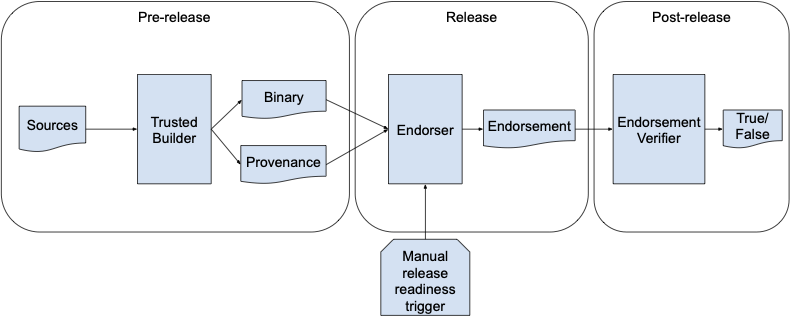

<!-- Logo Start -->
<!-- An HTML element is intentionally used since GitHub recommends this approach to handle different images in dark/light modes. Ref: https://docs.github.com/en/get-started/writing-on-github/getting-started-with-writing-and-formatting-on-github/basic-writing-and-formatting-syntax#specifying-the-theme-an-image-is-shown-to -->
<!-- markdownlint-disable-next-line MD033 -->
<h1><picture><source media="(prefers-color-scheme: dark)" srcset="https://github.com/project-oak/oak/blob/main/docs/oak-logo/svgs/oak-transparent-release-negative-colour.svg?sanitize=true"><source media="(prefers-color-scheme: light)" srcset="https://github.com/project-oak/oak/blob/main/docs/oak-logo/svgs/oak-transparent-release.svg?sanitize=true"></picture></h1>

The Transparent Release project builds on the idea of binary transparency and extends it in a few
directions, as described below. 

## Release Transparency

The goal of release transparency is to generate and transparently publish non-forgeable metadata
about a released binary. We refer to this kind of metadata as the endorsement statement. It can be
used in scenarios where the identity of a binary must be verified before use. One prominent use
case is remote attestation. See [Oak’s remote attestation protocol](https://github.com/project-oak/oak/tree/main/remote_attestation) for instance.

The life cycle of an endorsement statement has three phases as shown in the diagram below:

### The pre-release phase
In this phase, a trusted builder, for instance [the generic slsa-generator GitHub workflow](https://github.com/slsa-framework/slsa-github-generator/blob/de4491844e9be4184f786666af40f5b1b8e7ddc0/internal/builders/generic/README.md),
generates a binary and a corresponding SLSA provenance statement. The trusted builder also signs
the generated SLSA provenance statement. A provenance statement is another type of metadata about a
binary that describes how and from which sources the binary was generated. Both the SLSA provenance
statements, and our endorsement statements are customizations of the in-toto statements standard,
and refer to one or more binaries as the subject of the statement. A binary can be uniquely
identified by its cryptographic hash. The cryptographic hash function often used for identifying a
binary is SHA256. For details about the format of the provenance statement please refer to
[the SLSA provenance documentation](https://slsa.dev/provenance/v0.2).

We need provenance statements to be signed and published in a transparency log. This log, in case
of the generic slsa-generator GitHub workflow, is an instance of Rekor hosted by sigstore. The
binary is often uploaded to a storage server for future use. This can be content-addressable storage
such as [ent](https://github.com/google/ent). 

### The release phase
A binary is often released when some release-readiness criteria are met. Evaluating
release-readiness criteria often requires manual effort. As a result, triggering the release
process is often manual as well. To transparently document the fact that a binary meets the
release-readiness criteria and is endorsed for use, in the release phase, an endorsement statement
is generated, signed, and published transparently. 

An endorsement statement specifies that a binary, identified by its cryptographic hash, is endorsed
for use for a specific time range. An endorsement statement is a special type of claim in our
design. For more information about the format of an endorsement statement see [the claim format](docs/claim-transparency.md#the-claim-format)
and [this example endorsement](schema/amber-claim/v1/example.json). 

Endorsement statements can be generated using a tool that we call _endorser_. Given a binary, a
non-empty list of its provenances, and a validity time range, the endorser generates an endorsement
statement. The release team has to separately sign and publish the endorsement statement in a
transparency log. 

Before generating the endorsement statement, the endorser performs a number of verification steps.
Ideally the verification logic should be flexible enough to allow verifying arbitrary conditions
(including some or all of the release-readiness criteria). However, currently we have only a minimal
implementation that verifies the presence and correctness of at least one provenance statement for
the binary. 

The endorser must be fed with any required information to perform the verification. In its simplest
form, and as shown in the diagram, the binary and its provenance are fed as inputs to the endorser.
Strictly speaking, the binary itself is not necessary as an input. What we actually need is the
cryptographic hash of the binary. The input provenances used during the verification are included
as evidence in the generated endorsement statement. The endorsement statement format allows
including different types of evidence, but with the minimal verification, the only type of evidence
is a provenance statement. Note that while provenances are often signed by the trusted builder
generating the binary, an endorsement statement must be signed by the team releasing the binary. 

It is possible to provide multiple provenances, generated and signed by different trusted builders,
as input to the endorser. This provides stronger trust on the claim provided by the provenance
statements. In such situations, all provenances must be included in the list of evidence in the
endorsement statement. 

#### Passive Revocation
The most important piece of information that distinguishes an endorsement statement from a
provenance statement is the validity time range. Since endorsement statements are published in a
transparency log, and therefore cannot be removed or modified, a mechanism is required for revoking
them once they no longer are valid (e.g., once a security vulnerability is discovered in the
endorsed binary). Revocation is often implemented by specifying a validity time range. This
mechanism is called passive revocation. 

### The post-release phase
After a binary is released, and an endorsement statement is generated and transparently published,
the endorsement statement can be used wherever trust in the binary, its validity, and its origin is
required. One such use case is remote attestation. In this scenario, an endorsement statement is
used to verify the identity of a binary running on a remote server. The minimal verification of an
endorsement statement involves verifying that it is signed by the expected release team (by
verifying the signature using the public key of the release team), and the validity time range has
not expired.

## Claim Transparency

An endorsement statement is in essence a claim about a binary. A wide range of claims, beyond the
endorsements, can be imagined about binaries. For instance, any release-readiness criteria can be
stated in terms of a claim about the binary. [Claim Transparency](docs/claim-transparency.md)
provides a generic and customizable format for specifying claims and exemplifies a few types of
security and privacy claims about binaries. 

## Policy Transparency
Policy transparency builds on top of claim transparency, and allows combining claims, according to
a policy, to either make a decisions (e.g., to trust a binary for a specific purpose or not), or
generate a summary of a large number of claims. Summary claims allow reusing the verification
effort across invocations. 

There is a duality between claims and policies. A claim about a binary may imply that a specific
policy was followed when releasing a binary. On the other hand, a policy can specify if a claim
about a binary can be believed or trusted. More specifically, policies can be used for stating
release-readiness criteria, or for specifying conditions for accepting a binary, for instance in a
remote attestation scenario.  

Read more about Policy Transparency in [Policy Transparency: Authorization Logic Meets General Transparency to Prove Software Supply Chain Integrity](https://research.google/pubs/pub51673/).

