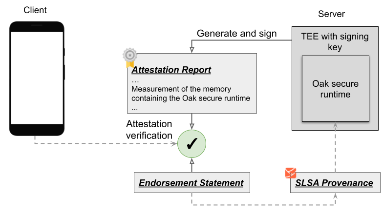

# Release Transparency for Confidential Computing

In this document we explain the use of transparent release process in the context of confidential
computing and remote attestation. We use [Project Oak](https://github.com/project-oak/oak) as our
case study, and explain, how, starting from SLSA provenances, you can generate non-forgeable
endorsement statements that can be used as evidence for verification of a remote attestation report.

## Confidential Computing

[Confidential computing](https://confidentialcomputing.io/) is a privacy-preserving computation
principle that leverages Trusted Execution Environments (TEE) to protect data as it is being
processed. A TEE is a secure area within a main processor that runs an isolated environment parallel
to the main operating system. Through this hardware-level isolation, the TEE guarantees that data
and code loaded into its memory cannot be read or tampered with by malicious processes.

In addition, a TEE attests to the identity of the software running inside it by providing a
cryptographic measurement of that software. The TEE then signs the measurement with a signing key
only accessible to it, to prove itself as the origin of the measurement.

Relying on this technology, [Project Oak](https://github.com/project-oak/oak) is developing a secure
runtime, and a remote attestation process to attest to the identity of the runtime, and the workload
running inside it.

Clients connecting to a server running the Oak secure runtime can use this information to verify the
identity of the server-side stack, i.e., the cryptographic measurement of the Oak secure runtime and
the workload running inside it that handles the user data. However, additional evidence is required
to verify the integrity of this stack.

## Software Integrity and Transparency

The transparent release process utilizes SLSA provenances to protect against software supply chain
attacks, and provide evidence of the integrity and trustworthiness of the Oak secure runtime. More
specifically, for each released version of the Oak secure runtime, the Oak team generates an
[endorsement statement](claim-transparency.md#endorsement-claims) for the binary, and signs it using
a key accessible only to the Oak team. The endorsement statement references the binary’s provenance
statement and can only be generated if the provenance statement passes some verification checks.

When establishing a connection to the server, this endorsement statement is provided to the client
for verification, alongside the cryptographic measurement from the TEE. In particular, the client,
as part of verifying the received attestation report, checks that the binary identities in the
attestation report and the endorsement statement are the same. This, together with verifying the
signature of the endorsement statement, guarantees that the Oak secure runtime is open source, has a
publicly published non-forgeable SLSA v1.0 provenance with adherence to SLSA Build Track 3
associated with it, and is transparently released.

The following is a simplified visualization of this scenario.

## Verification Steps

In a complete solution, both the provenance and the endorsement statement need to be verified. The
provenance statement needs to be verified when issuing the endorsement statement, and the
endorsement statement is verified, by the client, when establishing a connection to the server, as
described above. In both cases, the minimum verification involves verifying the signature and its
proof of inclusion in a public transparency log. See the
[slsa-verifier](https://github.com/slsa-framework/slsa-verifier) for more details on signature
verification for the provenances. Signature verification for endorsements is similar.

If the provenance is a SLSA v1.0 provenance generated by the
[Container-based SLSA3 builder](https://github.com/slsa-framework/slsa-github-generator/tree/main/internal/builders/docker),
then the [verification package](/internal/verification) in this repository can be used to verify
details of the build process. The same verification support is used in our
[endorser package](/internal/endorser), which provides utilities for generating endorsement
statements.

In Project Oak for instance, we want to make sure the build command does not use any potentially
malicious tool. This is achieved by comparing the build command against a set of allow-listed
tokens, which we provide to the endorser as a collection of reference values.

Beyond this, SLSA v1.0 provenances generated by the Container-based SLSA3 builder can be verified by
rebuilding the binary, if the builds are reproducible (see https://reproducible-builds.org/). This
can be done using the
[`verify` command](https://github.com/slsa-framework/slsa-github-generator/tree/main/internal/builders/docker#the-verify-command)
in the
[Docker-based command-line tool](https://github.com/slsa-framework/slsa-github-generator/tree/main/internal/builders/docker#command-line-tool)
that is internally used in the Container-based SLSA3 builder.

The `verify` command rebuilds the binary using the provenance’s build definition and checks that the
resulting artifacts have the same digests specified in the subject of the provenance. Rebuilding the
binary may be an expensive operation with respect to resource and time requirements. As a result, we
don't use this approach for verifying provenances in the [endorser](/internal/endorser). However,
anyone can use the `verify` command to asynchronously check the reproducibility of the build.
